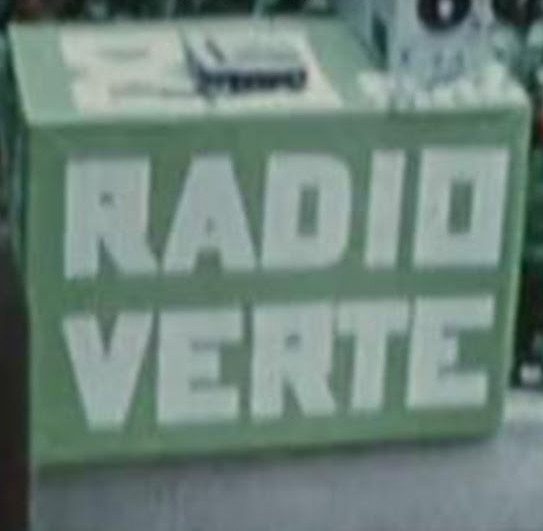

Avant de s’intéresser à la politique autour du climat, il préférable de voir comment l’écologie est entrée dans la politique. Nous prendrons ici l’exemple de la France

Dans les 1960, la communauté scientifique prend réellement conscience que les humains impactent la nature et qu’ils sont responsables de pas mal des catastrophes. Les scientifiques ont beau alerter les politiques, ils sont très mal reçu car ils demandent des changements importants pour l’économie. Les politiques même s'ils sont au courant des risques ne changent pas réellement car cela leur apporterait pas grand chose au niveau de l’électorat et de l’économie. Ce seront les mouvements sociaux qui vont porter l’écologie dans le débat politique notamment avec les manifestations de Mai 1968. C’est ce qui donnera pendant longtemps l’image de l’écologie: une “idéologie” libertaire, hippie. Après ces manifestations des journaux avec comme thème central l’écologie commence à apparaître. Une radio pirate nommé “Radio Verte” verra même le jour avec comme objectif de sensibiliser la population afin d’obtenir des changements politiques.

_Radio Verte, image de la chaîne youtube Ina Société_

Depuis l’écologie prend de plus en plus de place dans la politique française. En 1974, le premier candidat écologiste se présente aux élections présidentielles. En 1984, le premier parti écologiste est créer: les “Verts” qui deviendra “Europe Ecologie les Verts”. Mais l’écologie ne reste pas cantonné à “Europe Ecologie les Verts”. De plus en plus de partis se revendique comme étant écologistes. Cela peut être vu positivement puisque cela amène l’écologie au coeur de la scène politique mais on peut aussi redouter que cela ne soit qu’une excuse électorale.

Source:

- [France Culture](https://www.franceculture.fr/politique/quand-l-ecologie-devient-politique)
